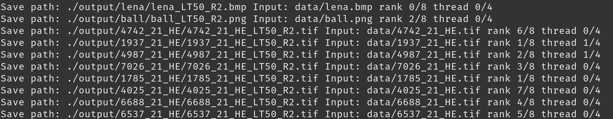
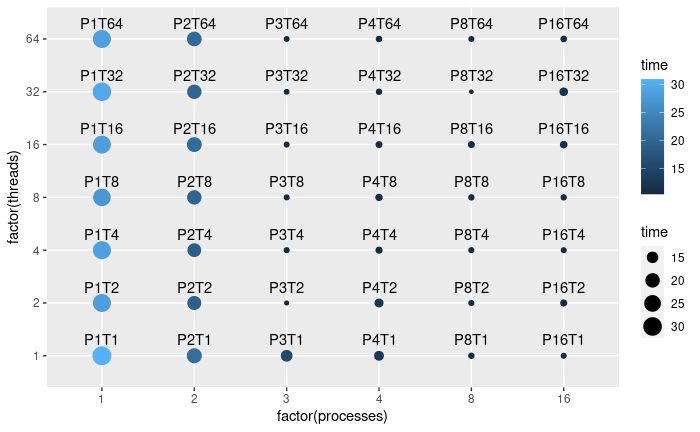

# Edge Detection Filter

Program's outputs, images with edge detection, are located in a new `output` subdirectory created based on names of input images found in the `data` folder.  

Image filter is using the Canny edge detector to identify edges in given images. We conducted numerous attempts with various minimum cut-off suppression values in the dataset. We realized the algorithm execution using multithreading and shared-memory multiprocessing to speed up finding edges in all images. However, it is not trivial to determinate lower bound threshold values.

## Authors
 - [Erik Matovič](https://github.com/Matovic)
 
## Installation instructions

Depending on your system of choice you will need to install the following dependencies:
* mpiCC - Open MPI C++ wrapper compiler 
* [CMake](https://cmake.org) build system
* [Open MPI](https://www.mpi-forum.org/) - The Message Passing Interface
* [OpenMP](https://www.openmp.org/) - The Open Multi-Processing
* [OpenCV](https://opencv.org/) - The Open Source Computer Vision Library

You can also use CMake directly to generate project files, see [Usage](#Usage).

## Usage

You can generate the project files by using the bash script from command line as shown below. It will generate the default for the given platform. It can be changed by adding a generator for your IDE. To find out all available generators, just run `cmake --help`.

```bash
./runCMake.sh src/main.cpp
```

After installation, the file should be installed into a new `_install` subdirectory. You can then run tests as follows:

```bash
./testProgram.sh
```

## Data

Our data consists of time for each process and each thread. We created this dataset using the `testProgram.sh` bash script. The program run the Canny edge detection filter for 10 images(8 of them where roughly 1GB).

Our data consists of time for each process and each thread. We created this dataset using the `testProgram.sh` bash script. The program run the Canny edge detection filter for 10 images(8 of them where roughly 1GB). Here is our dataset:

## Evaluation

In the `evaluation` folder, we provided time tests. We created a bash script for the time tests that write a specific time of each program's execution in a CSV file. Subsequently, we conducted an evaluation using the programming language R, where we evaluated our tests using descriptive statistics.

One of the tested inputs with a preview of one of his outputs with settings of low threshold equals 50 and ratio equals 2:  

<p align="center">
	
	
</p>

Proof that the program realizes edge detection in different processes and even in separate threads, rank is the process's ID. When one process makes edge detection for more than one file, it uses different threads for every image if there are available.

<p align="center">
  
</p>

Preview from the evaluation file:  

<p align="center">
	
</p>


## Conclusion

We have found out that using multiprocessing with multithreading provides time-saving around 66%. However, parallelization is not infinite; there are limitations.  We have been using ten images, and therefore the best times reached 3 and 4 processes with multithreading and 8 and 16 processes, where multithreading did not matter. We also provided time savings, roughly 66% against the sequential program.  This proves that the program parallelization with an increased number of images provides time savings. Still, many processes with several threads must be used accordingly to many photos. The best time for ten images has eight processes with 32 threads.
